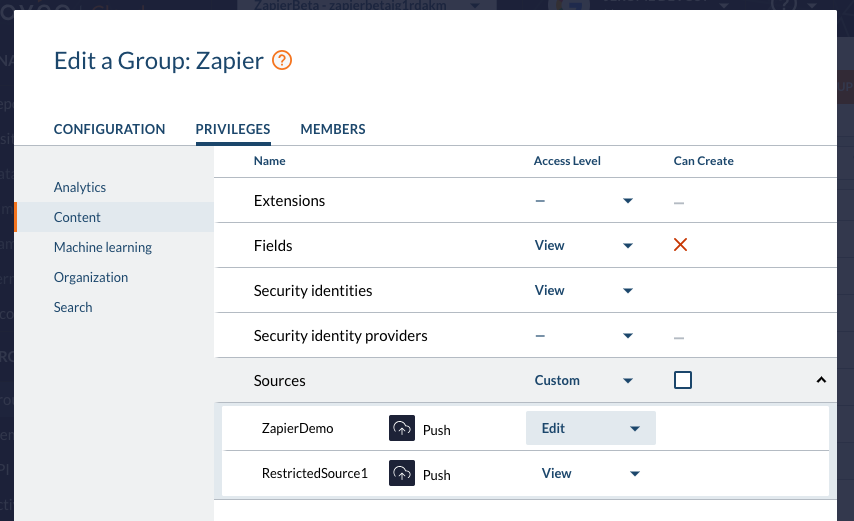

## Does the Coveo account need any special account permissions?

User would need to have ___Edit___ permission on at least one Push source:

You can review Coveo's documentation on [Required Privileges](https://onlinehelp.coveo.com/en/cloud/sources.htm#privileges)
and [Push API Usage Overview](https://docs.coveo.com/en/50/cloud-v2-developers/push-api-usage-overview) for more information.

## Document IDs

Documents in a Coveo index are uniquely identified by a _documentId_. Coveo expects  these ids to be in URI format. It doesn't need to map to a real resource; any _name_://_path_ is valid.

For example, these are valid for _documentId_:
* `gmail://12345`
* `https://zapier.com`
* `https://zapier.com/help/coveo`
* `discuss://category1/topic2/post3`

These are invalid and the documents will be rejected:
* `/a/b/c`
* `gmail:12345`
* `gmail/12345`
* `zapier.com/help/coveo`

## Understanding delays and responses from Push and Delete

When pushing and deleting documents, you get a successful response (`202`) when the document is successfully added to the pipeline queue.

In other words, pushing invalid data (like with a invalid _documentId_) may result in a successful response. The document will be reject later it's processed by the queue. You can see these errors in Coveo's Log Browser.

Deleting a document using a _documentId_ that doesn't exist will also give you a successful response, because the call was added to the queue. The error will be raised when it's actually processed.

## I don't my values for my fields in the index

When using custom fields in action __Push or Update Content__, you need to create or make sure the fields exists in your Coveo index. Otherwise they will simply be ignored.

## Validating Push action with the Content Browser

You can use Coveo's [Content Browser](https://platform.cloud.coveo.com/admin) and sort by _Indexed date_ to see if you Zap successfully pushed your content.
